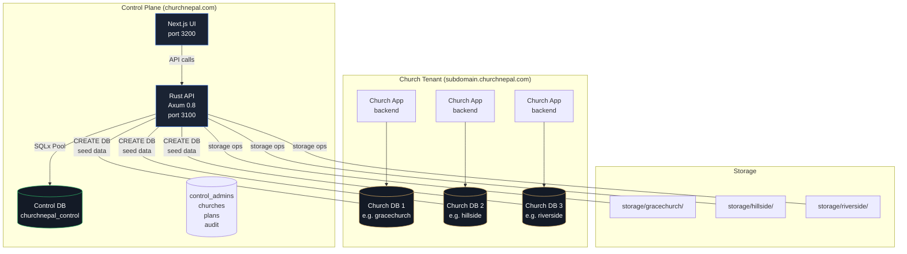
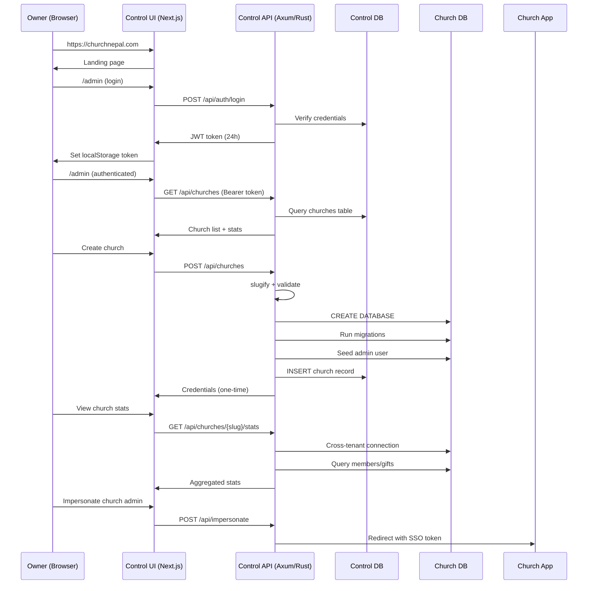

# Control Plane Architecture

**Last Updated**: 2026-07-19
**Status**: Active

## Overview

The ChurchNepal control plane is the master management console at churchnepal.com. It provisions, governs, and oversees all church subdomain sites. Each church has its own isolated Postgres database, storage folder, and subdomain — all managed from this central control plane.

Key architectural principles:
- **Multi-tenancy**: One Postgres instance, one database per church
- **Isolation**: Each church has isolated DB, storage, and subdomain
- **Control Plane**: Manages all churches from a central location
- **Single Process**: Control API runs as one Axum server; Church app uses multi-tenant middleware

## Architecture



### Request Flow



## Control Plane Components

### Backend (Rust/Axum)

```
control-plane/backend/
├── src/
│   ├── main.rs         # Entry point, server setup, migration runner, super-admin seeding
│   ├── config.rs       # Configuration (env vars, church DB URL builder)
│   ├── auth.rs         # JWT token creation/validation, SuperAdmin extractor
│   ├── error.rs        # AppError type with status codes
│   ├── handlers.rs     # API route handlers (login, me, churches CRUD)
│   └── provision.rs    # Church provisioning (DB, storage, admin seeding)
├── migrations/
│   └── 001_control.sql # Control DB schema (control_admins, churches)
└── Cargo.toml          # Dependencies (axum 0.8, sqlx 0.8, jsonwebtoken 9, bcrypt 0.17)
```

### Frontend (Next.js)

```
control-plane/nextjs/
├── app/
│   ├── layout.tsx      # Root layout with metadata
│   ├── page.tsx        # Landing page (marketing site)
│   ├── globals.css     # Dark theme CSS variables (--bg, --panel, --accent, etc.)
│   └── admin/
│       └── page.tsx    # Admin dashboard (login + churches UI)
├── package.json        # Next.js 16.2.10, React 19.2.0
└── ...
```

## Database Schema

### Control Database (`churchnepal_control`)

```sql
-- control-plane/backend/migrations/001_control.sql

-- Super-admins who manage the platform
CREATE TABLE control_admins (
    id UUID PRIMARY KEY DEFAULT gen_random_uuid(),
    email VARCHAR(255) UNIQUE NOT NULL,
    password_hash TEXT NOT NULL,
    name VARCHAR(255) NOT NULL DEFAULT 'Owner',
    created_at TIMESTAMP DEFAULT CURRENT_TIMESTAMP
);

-- Registry of all churches
CREATE TABLE churches (
    id UUID PRIMARY KEY DEFAULT gen_random_uuid(),
    name VARCHAR(255) NOT NULL,
    slug VARCHAR(63) UNIQUE NOT NULL,  -- db_name, storage folder, subdomain label
    db_name VARCHAR(63) NOT NULL,
    storage_path TEXT NOT NULL,
    subdomain VARCHAR(255) NOT NULL,
    admin_email VARCHAR(255) NOT NULL,
    status VARCHAR(32) NOT NULL DEFAULT 'active',  -- active | suspended
    created_at TIMESTAMP DEFAULT CURRENT_TIMESTAMP
);

CREATE INDEX idx_churches_slug ON churches (slug);
```

### Church Database (per-tenant)

Each church database has its own schema defined in `backend/migrations/`. Key tables include:

- `users` - Admin users (email, password_hash, name, role)
- `people` - People records
- `members` - Church members
- `giving` - Financial records
- `sermons`, `events`, `ministries`, `leaders`, etc. - Church content

## Cross-Tenant DB Access

The control plane connects to individual church databases via the superuser connection:

```rust
// config.rs
pub fn church_db_url(&self, slug: &str) -> String {
    // Converts pg_super_url from ".../postgres" to ".../{slug}"
    match self.pg_super_url.rfind('/') {
        Some(i) => format!("{}/{}", &self.pg_super_url[..i], slug),
        None => format!("{}/{}", self.pg_super_url, slug),
    }
}
```

During provisioning, the control plane uses this pattern to connect to each church's database. A reusable cross-tenant helper will be built in Task 8.

**Safety Rules**:
1. Slug validation: `[a-z][a-z0-9]{2,63}` - starts with lowercase letter, only lowercase letters/digits
2. No raw SQL interpolation - use parameterized queries where possible
3. Database name interpolation only after slug validation
4. Connection pooling via `PgPoolOptions`

## Authentication Model

### SuperAdmin (Control Plane)

- **JWT Token**: Signed with `JWT_SECRET` (24-hour expiry)
- **Claims**: `sub` (user ID), `email`, `exp`
- **Header**: `Authorization: Bearer <token>`
- **Extractor**: `SuperAdmin` extractor validates on every endpoint

```rust
// auth.rs
pub struct SuperAdmin {
    pub id: String,
    pub email: String,
}

// Used as extractor on protected routes
pub async fn list_churches(_admin: SuperAdmin, State(st): State<AppState>) -> ...
```

### Church Admin (Subdomain)

- **JWT Token**: Signed with church-specific secret (different from control)
- **Impersonation**: Control plane can mint valid church JWTs for SSO support
- **Roles**: admin (full), editor (content), viewer (read-only)

## Tech Stack

| Layer | Technology | Version |
|-------|------------|---------|
| Backend Framework | Axum | 0.8 |
| Runtime | Tokio | 1.x |
| Database | PostgreSQL + SQLx | 0.8 |
| JWT | jsonwebtoken | 9 |
| Password Hashing | bcrypt | 0.17 |
| Env Loading | dotenvy | 0.15 |
| Frontend | Next.js | 16.2.10 |
| React | React | 19.2.0 |
| Language | TypeScript | 5.x |

## Ports

| Component | Port | URL | Notes |
|-----------|------|-----|-------|
| Control API | 3100 | http://localhost:3100/api | REST endpoints |
| Control UI | 3200 | http://localhost:3200 | Next.js dev server |
| Church App (dev) | 3005 | http://{slug}.localhost:3005 | Multi-tenant backend |

## API Endpoints (Current)

| Method | Path | Handler | Auth |
|--------|------|---------|------|
| POST | /api/auth/login | `handlers::login` | No |
| GET | /api/auth/me | `handlers::me` | SuperAdmin |
| GET | /api/churches | `handlers::list_churches` | SuperAdmin |
| POST | /api/churches | `handlers::create_church` | SuperAdmin |
| DELETE | /api/churches/{id} | `handlers::delete_church` | SuperAdmin |

## Related

- Church App Architecture: See `backend/src/tenant.rs` for multi-tenant routing
- Church App Backend: See `backend/` directory
- Church App Frontend: See `nextjs/` directory

---

*This document is maintained as part of the ChurchNepal control plane. Last updated: Task 1 complete.*